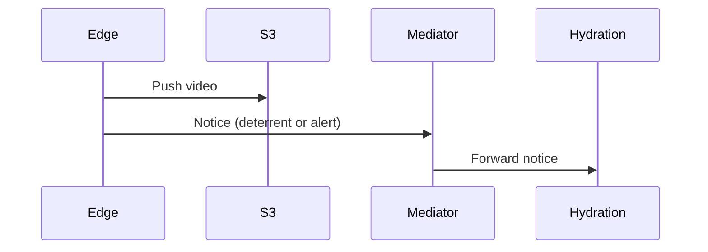
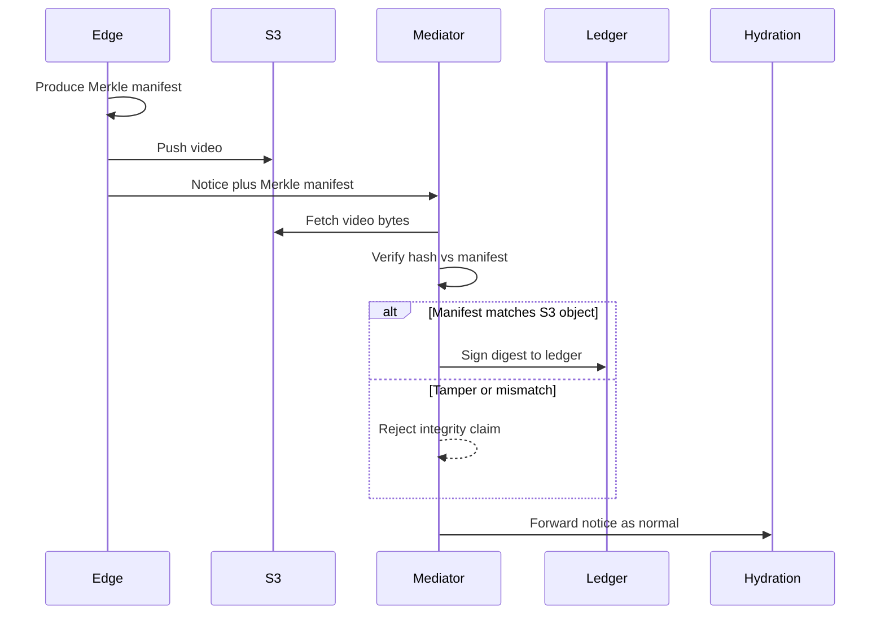

# hack-verify-media

Prove that media captured on an edge unit arrives in the cloud untampered.

## Premise

1. **Edge** — When a unit records media, it hashes the file (chunked SHA-256 → Merkle root) and keeps that digest as the unit’s integrity claim for the capture.
2. **Cloud** — On upload (for example through Mediator or a similar service), the same hashing is run again against the received bytes.
3. **Ledger** — If the cloud hash matches the edge hash, the digest can be signed and written to a blockchain ledger. A match means the bytes were not altered in transit; the ledger anchors that claim to a specific unit and time.

This repository is a **demo** of the hash and verify steps, plus a **local append-only ledger** that records Merkle roots. It does not implement Mediator upload, cryptographic signing, or a public blockchain yet—only the integrity math you would run on the edge and again in the cloud, and a local tamper-evident ledger standing in for the ledger step.

### Current flow

Edge uploads media and a separate notice; Mediator forwards the notice for hydration. There is no integrity check against the object in S3.



### Target flow

Edge builds a Merkle manifest first, then uploads the video and includes that manifest with the Mediator notice. Mediator verifies the S3 object against the manifest; on success it signs the digest to the ledger. The alert/notice path continues as today.



## How hashing works

- Split the file into fixed-size chunks (default **256 KiB**; last chunk may be shorter).
- SHA-256 each chunk (leaf hashes).
- Build a binary **Merkle tree** over those leaves (odd nodes are duplicated) and take the root.

Verification re-hashes a file with the same chunk size recorded in the expected Merkle JSON and compares. A mismatch fails verification and reports which chunk indices differ.

## Setup

```bash
npm install
```

Optional: rebuild sample videos under `fixtures/media/` (needs `curl`, `ffmpeg`, `python3`):

```bash
npm run fixtures:fetch
```

See [fixtures/README.md](fixtures/README.md) for fixture details and licenses.

## Commands

| Command | Purpose |
|---------|---------|
| `npm run hash -- <file> [chunk-size-bytes]` | Hash a media file; print Merkle JSON and write `<file>-hash.md` |
| `npm run verify -- <file>` | Re-hash `<file>`, compare to `<file>-hash.md`, write `<file>-verified.md` |
| `npm run test` | Unit tests + loose timing/resource checks |
| `npm run bench` | Print wall/CPU/memory table for synthetic sizes (and Chaplin if present) |
| `npm run build` | Compile TypeScript to `dist/` |
| `npm start -- hash \| verify …` | Run the compiled CLI the same way |

Default chunk size is `262144` (256 KiB). Override on hash with a trailing byte size, for example `1048576` for 1 MiB.

`verify` exits `0` on success and `1` on mismatch or error.

### Hash output shape

```json
{
  "chunkSize": 262144,
  "chunkCount": 5,
  "merkleRoot": "…"
}
```

Lean on purpose: no per-chunk hex list (saves RAM/disk on device). `hash` writes that JSON to `<file>-hash.md` for verify.

## Demo

```bash
npm run -s hash -- fixtures/media/chaplin_laughing_gas.mp4
npm run -s verify -- fixtures/media/chaplin_laughing_gas.mp4
# → chaplin_laughing_gas-verified.md contains VERIFIED
```

Larger chunks (for example 1 MiB):

```bash
npm run -s hash -- fixtures/media/chaplin_laughing_gas.mp4 1048576
```

## Ledger (local demo)

`ledger.ts` is a stand-in for the **Ledger** step above: an append-only,
hash-chained log of Merkle roots. Each block stores a media id, its Merkle root,
a timestamp, the previous block's hash (`prevHash`), and its own `blockHash`
(SHA-256 over the block's contents). Editing any block breaks the chain, which
`validate` detects and pinpoints.

> **Scope:** this is **tamper-evident, not tamper-proof** — anyone with write
> access to the ledger file can rebuild the whole chain. Turning it into a truly
> immutable ledger means committing the head hash to an external source of truth
> (a public chain / signed anchor). The `Anchor`/`NoopAnchor` seam in `ledger.ts`
> is where that plugs in (output shows `anchor local-only` until then). See
> [docs/blockchain-ledger-report.md](docs/blockchain-ledger-report.md) for options.

```bash
# Append a block per file — each prints the new block as it lands
npm run ledger -- append fixtures/media/demo_clip.mp4
npm run ledger -- append fixtures/media/chaplin_laughing_gas.mp4

npm run ledger -- list        # show the whole chain + validity
npm run ledger -- validate    # exit 0 if intact, 1 if broken
npm run ledger -- tamper 1    # DEMO: corrupt block #1, then re-run validate
```

The ledger is written to `./ledger.json`; override the path with `LEDGER_PATH`.

## Project layout

```text
src/
  hash.ts         SHA-256 helper
  chunks.ts       Exact file chunk hashing (default 256 KiB)
  merkle.ts       Merkle root over leaf hashes
  fileMerkle.ts   Orchestrate file → MerkleResult
  verify.ts       Compare actual vs expected Merkle JSON
  ledger.ts       Append-only hash-chained ledger of Merkle roots (local demo)
  main.ts         CLI: hash | verify
fixtures/         Sample media and golden roots
scripts/          Fixture download / edit helpers
```
